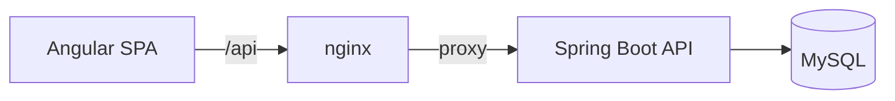

# Taskflow

> Task management with priorities and reminders, built on Spring Boot and Angular.

[](https://github.com/eliangilsierra/taskflow/actions/workflows/back.yml)
[](https://github.com/eliangilsierra/taskflow/actions/workflows/web.yml)
[](https://github.com/eliangilsierra/taskflow/actions/workflows/docker.yml)
[](LICENSE)


Taskflow is a full-stack task manager. Every task has a priority, an optional due date and an
optional reminder, and each user only ever sees their own work.

It is also a reference project for a clean, production-minded codebase: Clean Architecture on the
backend, an architecture that is enforced by tests, versioned database migrations, stateless
authentication, and a CI pipeline covering formatting, linting, tests and image builds.

## The problem

To-do lists scattered across notes, chats and emails carry no priority and no deadline, so things get
forgotten. Taskflow keeps them in one place, ranks them by urgency and reminds you before they slip.

## Features

- **Accounts and authentication.** Registration and sign-in with BCrypt-hashed passwords and
  short-lived JWT access tokens.
- **Task management.** Create, edit, complete and delete tasks with a title, description, priority
  (low, medium, high) and status (to do, in progress, done).
- **Due dates.** Overdue tasks are flagged automatically.
- **Reminders.** A scheduler delivers reminders when they come due, retrying failed deliveries.
- **Search, filter and sort.** Text search, status and priority filters, sorting by due date,
  priority or creation time, and pagination.
- **Private by design.** Users can only reach their own tasks; other users' tasks look like missing
  ones.
- **Consistent API.** RFC 7807 errors, bean validation, OpenAPI documentation and health probes.

## Screenshots

_Screenshots will be added under `docs/assets/`._

## Tech stack

| Area | Technology |
|---|---|
| Backend | Java 21, Spring Boot 3.3, Spring Security (JWT resource server), Spring Data JPA |
| Database | MySQL 8, Flyway migrations |
| Frontend | Angular 18 (standalone components, signals, typed reactive forms), TypeScript |
| API docs | springdoc-openapi (Swagger UI) |
| Quality | Spotless (Google Java Format), ESLint, Prettier, ArchUnit, JUnit 5, Mockito, Karma/Jasmine |
| Delivery | Docker, Docker Compose, nginx, GitHub Actions, Dependabot |

## Architecture overview



The backend is a modular monolith organized by feature. Each feature (`auth`, `tasks`) is split into
`domain`, `application`, `infrastructure` and `api` layers, and dependencies only point inward.
Persistence, hashing, token issuing and reminder delivery are ports implemented by adapters, so the
business rules have no dependency on Spring, JPA or HTTP. See [docs/architecture.md](docs/architecture.md)
and the [decision records](docs/decisions.md).

## Getting started

### Quick start with Docker

```bash
cp .env.example .env
# Set the passwords and JWT_SECRET in .env (generate one with: openssl rand -base64 48)
docker compose up --build
```

- Web app: <http://localhost:4200>
- API: <http://localhost:8080> · Swagger UI: <http://localhost:8080/swagger-ui.html>

### Local development

Requirements: JDK 21, Node.js 22 and a MySQL 8 instance (`docker compose up mysql` provides one).

```bash
# Backend
export DB_PASSWORD=change-me JWT_SECRET="$(openssl rand -base64 48)"
cd taskflow-back && ./mvnw spring-boot:run

# Frontend (in another terminal; proxies /api to the backend)
cd taskflow-web && npm install && npm start
```

See the [development guide](docs/development.md) for details.

## Environment variables

The most important ones are below; the full list is in [.env.example](.env.example) and the
[development guide](docs/development.md#configuration).

| Variable | Description |
|---|---|
| `DB_URL`, `DB_USERNAME`, `DB_PASSWORD` | Database connection. The password is required. |
| `JWT_SECRET` | Signing secret, at least 32 characters. Required, with no default. |
| `JWT_TTL` | Access token lifetime (default `1h`). |
| `REMINDERS_ENABLED`, `REMINDERS_INTERVAL` | Reminder scheduler switch and period. |

## Available scripts

| Where | Command | Purpose |
|---|---|---|
| `taskflow-back` | `./mvnw verify` | Compile, check formatting and run all tests |
| `taskflow-back` | `./mvnw spotless:apply` | Format the code |
| `taskflow-back` | `./mvnw spring-boot:run` | Run the API |
| `taskflow-web` | `npm start` | Dev server with the `/api` proxy |
| `taskflow-web` | `npm run lint` | ESLint |
| `taskflow-web` | `npm run format` / `format:check` | Prettier |
| `taskflow-web` | `npm run test:ci` | Unit tests in headless Chrome |
| `taskflow-web` | `npm run build` | Production build |

## Testing

```bash
cd taskflow-back && ./mvnw verify          # unit, integration and architecture tests
cd taskflow-web && npm run test:ci         # component and service tests
```

The backend suite covers domain rules, use cases, the full HTTP stack through the real security
chain and migrations, and the architecture rules. Integration tests run on H2 in MySQL mode; the
application was also verified against MySQL 8.

## API overview

| Method | Path | Description |
|---|---|---|
| `POST` | `/api/auth/register` | Create an account and receive a token |
| `POST` | `/api/auth/login` | Exchange credentials for a token |
| `GET` | `/api/auth/me` | The authenticated user |
| `GET` | `/api/tasks` | List tasks (`status`, `priority`, `q`, `sort`, `page`, `size`) |
| `POST` | `/api/tasks` | Create a task |
| `GET` | `/api/tasks/{id}` | Get a task |
| `PUT` | `/api/tasks/{id}` | Replace a task's editable fields |
| `PATCH` | `/api/tasks/{id}/status` | Change a task's status |
| `DELETE` | `/api/tasks/{id}` | Delete a task |

All `/api/tasks` and `/api/auth/me` calls require an `Authorization: Bearer <token>` header. Full
schemas are available in Swagger UI.

## Deployment

The `taskflow-back` and `taskflow-web` images are built by `docker compose build` and can be run on
any container platform.

- Provide `DB_URL`, `DB_USERNAME`, `DB_PASSWORD` and `JWT_SECRET` as secrets, never in the image.
- Serve the web image over HTTPS and keep `/api` on the same origin (the nginx image already
  proxies it to a service named `back`).
- Run a **single backend instance** for now: the reminder scheduler is not yet cluster-aware (see
  [ADR-007](docs/decisions.md#adr-007-reminders-by-polling-on-a-single-instance)).

## Project structure

```text
.
├── taskflow-back/         Spring Boot API (Maven)
│   └── src/main/java/io/github/eliangilsierra/taskflow/{shared,auth,tasks}
├── taskflow-web/          Angular application (npm)
│   └── src/app/{core,features,shared}
├── docs/                  architecture, development guide, decision records
├── .github/               CI workflows, issue and PR templates, Dependabot
├── docker-compose.yml     MySQL + API + web
└── .env.example           documented environment variables
```

## Roadmap

- [ ] Integration tests against MySQL with Testcontainers
- [ ] Refresh tokens and `HttpOnly` cookie sessions
- [ ] Login rate limiting
- [ ] Email and push delivery for reminders
- [ ] Projects, labels and recurring tasks
- [ ] Upgrade to the current Angular release
- [ ] End-to-end browser tests in CI

## Contributing

Contributions are welcome. Please read [CONTRIBUTING.md](CONTRIBUTING.md) first, and report security
issues privately as described in [SECURITY.md](SECURITY.md).

## License

Released under the [MIT License](LICENSE).
