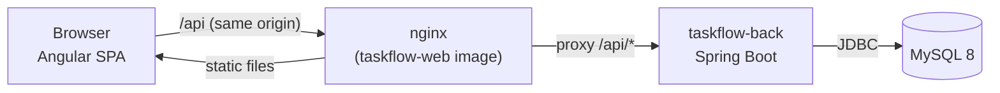
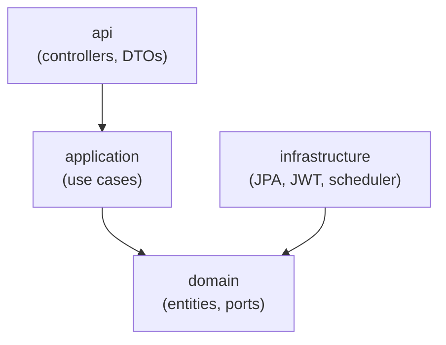
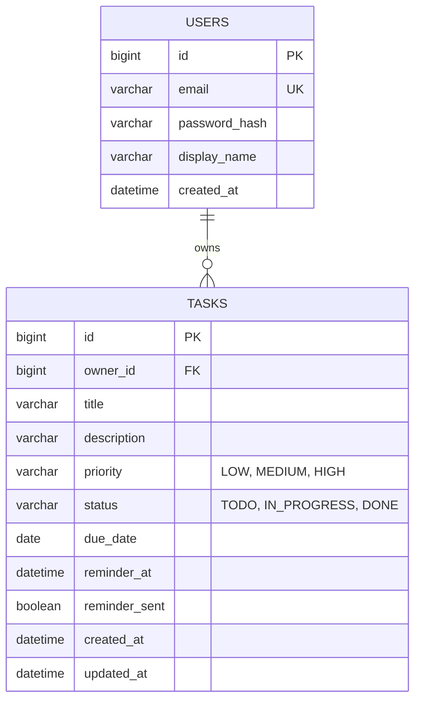
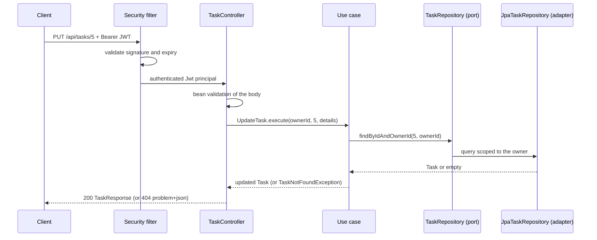

# Architecture

Taskflow is a **modular monolith** split into two deployable units that talk over a REST API:



- **`taskflow-web`** is a single-page application. In development `ng serve` proxies `/api` to the
  backend; in Docker nginx does the same. Because the browser only ever talks to one origin, no CORS
  configuration is needed.
- **`taskflow-back`** is a stateless REST API. All state lives in MySQL, and the schema is owned by
  Flyway migrations.

## Backend

### Organization: by feature, then by layer

The code is organized **by feature** (`auth`, `tasks`) so everything that changes together lives
together, and each feature follows Clean Architecture internally:

```text
io.github.eliangilsierra.taskflow
├── shared/                 cross-cutting code (no business rules)
│   ├── config/             typed properties, clock, OpenAPI
│   ├── error/              RFC 7807 handler and base exceptions
│   ├── pagination/         framework-independent page types
│   └── security/           helpers to read the caller from the token
├── auth/
│   ├── domain/             User, ports (UserRepository, PasswordHasher, AccessTokenIssuer)
│   ├── application/        use cases: RegisterUser, AuthenticateUser, GetCurrentUser
│   ├── infrastructure/     JPA adapter, BCrypt adapter, JWT issuer, Spring Security config
│   └── api/                controller and request/response DTOs
└── tasks/
    ├── domain/             Task, Priority, TaskStatus, TaskRepository, ReminderNotifier
    ├── application/        use cases: Create/Update/Get/List/Delete/ChangeStatus, DispatchDueReminders
    ├── infrastructure/     JPA adapter, reminder scheduler and notifier
    └── api/                controller and DTOs
```

### The dependency rule



Source-code dependencies only point **inward**:

| Layer | May depend on | Must not depend on |
|---|---|---|
| `domain` | the JDK and `shared.error` | Spring, JPA, HTTP |
| `application` | `domain` | controllers, JPA entities |
| `infrastructure` | `domain` | `api`, `application` |
| `api` | `application`, `domain` | `infrastructure` |

The domain declares *ports* (`TaskRepository`, `PasswordHasher`, `ReminderNotifier`, …) and the
infrastructure layer *implements* them (dependency inversion). Swapping MySQL for another store, or
the logging notifier for an email sender, does not touch a single use case.

Pragmatic trade-off: use cases carry Spring's `@Service` and `@Transactional`. That keeps wiring and
transactions declarative without dragging web or persistence types into the application layer.

### Domain model



`Task` is an immutable record. Every change (`update`, `changeStatus`, `markReminderSent`) returns a
new instance, and invariants (non-blank title, length limits) are enforced in the constructor, so an
invalid task cannot exist. Changing `reminderAt` re-arms the reminder.

### Request lifecycle



### Cross-cutting concerns

- **Errors.** `GlobalExceptionHandler` maps every failure to an RFC 7807 `application/problem+json`
  body. Validation failures add an `errors` array of `{field, message}`. Unexpected exceptions are
  logged server-side and returned as a generic 500 that never leaks internals.
- **Authorization.** Every task query includes the owner id. A task that belongs to someone else is
  reported as `404`, exactly like a missing one, so identifiers cannot be probed.
- **Security.** Stateless bearer authentication: passwords are hashed with BCrypt, access tokens are
  HS256 JWTs whose subject is the user id. See [decision records](decisions.md).
- **Configuration.** Everything environment-specific comes from environment variables and is bound
  to a validated `TaskflowProperties` record. The application refuses to start without a JWT secret
  of at least 32 characters.
- **Persistence.** Flyway owns the schema and Hibernate runs with `ddl-auto=validate`, so a
  mismatch between entities and migrations fails at startup rather than in production traffic.
- **Time.** A `Clock` bean is injected wherever "now" matters, which makes time-based behavior
  (reminders, overdue flags) deterministic in tests.
- **Observability.** SLF4J logging (identifiers, never emails or passwords) and the Actuator health
  endpoint with liveness and readiness probes.

### Reminders

`ReminderScheduler` polls every minute (configurable). `DispatchDueReminders` loads up to 100 tasks
whose `reminder_at` has passed, are not `DONE` and have `reminder_sent = false`, hands each to a
`ReminderNotifier`, and marks it as sent. A failure for one task is logged and retried on the next
run without blocking the others. The default notifier only logs; delivering email or push
notifications means adding another `ReminderNotifier` implementation.

## Frontend

```text
src/app
├── core/                   app-wide singletons
│   ├── auth/               AuthService (signals), interceptor, guards
│   └── http/               API base path, error message mapping
├── features/
│   ├── auth/               login and registration pages
│   └── tasks/              list, form, service, models, routes (lazy loaded)
└── shared/                 small reusable helpers
```

- **Standalone components**, signals for local state and the new control-flow syntax.
- **Typed reactive forms** with client-side validation that mirrors the API rules.
- **Route guards** protect `/tasks` and keep signed-in users off the login page; every feature is
  **lazy loaded**.
- **One HTTP interceptor** attaches the bearer token to `/api` calls and signs the user out when the
  API answers `401`.
- **Error handling** goes through `describeApiError`, which turns problem details into
  user-friendly messages and never shows raw server output.

## Testing strategy

| Level | Backend | Frontend |
|---|---|---|
| Unit | Domain rules and use cases with Mockito | Services, guards, interceptor, helpers |
| Component / integration | `@SpringBootTest` + MockMvc through the real security chain and Flyway migrations on H2 (MySQL mode) | Component tests with `TestBed` |
| Manual / smoke | Verified against a real MySQL 8 (migrations, schema validation, scheduler) | Browser run through the full flow behind nginx |

Automated backend tests use H2 in MySQL mode for speed and zero setup. Running them against a real
MySQL with Testcontainers is on the [roadmap](../README.md#roadmap).
